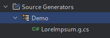

  

# Introduction

Fluent Code Generators provide fluent API for [Roslyn Source Generators](https://learn.microsoft.com/en-us/dotnet/csharp/roslyn-sdk/#source-generators) that enable developers to write custom source code generators in a more predictable and controllable way. Fluent Code Generators packages are compatible with any version of .NET that is supported by [Roslyn Incremental Generators](https://github.com/dotnet/roslyn/blob/main/docs/features/incremental-generators.md). Packages are distributed as .NET Standard.
This project is part of Hamster Wheel platform, a dynamically configurable, extensible API that aims to be an easy-to-use, secure solution for data manipulation of your choice. It is intended to be used for personal projects, hobbyists and small companies. 


## Reference links

- [Writing a simple C # source code generator with Fluent API](https://internetexception.com/2025/10/02/writing-simple-c-source-code-generator/)
- [Roslyn Incremental Generators](https://github.com/dotnet/roslyn/blob/main/docs/features/incremental-generators.md)
- [Roslyn Source Generators](https://learn.microsoft.com/en-us/dotnet/csharp/roslyn-sdk/#source-generators)
- [Roslyn Incremental Generators Cookbook](https://github.com/dotnet/roslyn/blob/main/docs/features/incremental-generators.cookbook.md)
- [Hamster Wheel](https://internetexception.com/why-hamster-wheel/)

## What's contained in this project

This project contains of two main parts:
- main package: HamsterWheel.FluentCodeGenerators that is Incremental Code Generators Fluent API
- and HamsterWheel.FluentCodeGenerators.Abstractions package that can be used to further develop extensions for APIs and functionalities missing from the main package

Navigation:
- [How to use](#how-to-use)
  - [Getting Started](#getting-started)
  - [Using your code generator inside the solution](#using-your-code-generator-inside-the-solution)
- [Using Code Generators Fluent API](#using-code-generators-fluent-api)
  - [Additional Files Providers](#additional-files-providers)
  - [Compilation Providers](#compilation-providers)
  - [Analyzer Config Options Provider](#analyzer-config-options-provider)
  - [Combining Providers](#combining-providers)
  - [Using Fluent API for code generation](#using-fluent-api-for-code-generation)
    - [Generating Enums](#generating-enums)
    - [Automated usings management](#automated-usings-management)
    - [Generating Enums](#generating-enums)
    - [Generating classes](#generating-classes)
      - [Base Class](#base-class)
      - [Add Interfaces](#add-interfaces)
      - [Add Attribute](#add-attribute)
      - [Adding Primary Constructor](#adding-primary-constructor)
      - [Adding Constructor](#adding-constructor)
      - [Add Property](#add-property)
      - [Add Field](#add-field)
      - [Add Method](#add-method)
      - [Sealed, Partial, Abstract and Static classes](#sealed-partial-abstract-and-static-classes)
      - [Add arbitrary code](#add-arbitrary-code)
      - [Add arbitrary code](#add-arbitrary-code)
    - [Change visibility modifier](#change-visibility-modifier)
- [Reporting diagnostics](#reporting-diagnostics)
- [Sharing pieces of logic](#sharing-pieces-of-logic)
  - [Sharing via Configurators](#sharing-via-configurators)
  - [Sharing via CodeChunks](#sharing-via-codechunks)
- [Known issues](#known-issues)

# How to use

Below you can find instructions on how to get you started using Flunt Code Generators.

## Getting started

To create your own Nuget package with code generator, first you must prepare a new project that can be used as Roslyn Analyzer/Source Generator. This project must use the.NET Standard 2.0 Framework moniker.

```xml
<TargetFramework>netstandard2.0</TargetFramework>
```

Then you must install the package in this project.

```xml
<PackageReference Include="HamsterWheel.FluentCodeGenerators" Version="0.4.0" PrivateAssets="all" />
```


Any Roslyn custom component needs to be marked as one in its `.csproj` file. You need to add the following properties to `<PropertyGroup>` section:

```xml
<IsRoslynComponent>true</IsRoslynComponent>
<EnforceExtendedAnalyzerRules>true</EnforceExtendedAnalyzerRules>
```

Since this will be a code generator package (or Analyzer how it is called by Roslyn) and it is not meant to be a dependency nuget package, it is good to add the following property:

```xml
<IncludeBuildOutput>false</IncludeBuildOutput>
```

This will disable bundling its `.dll` file in `lib` directory of Nuget package. Instead, we need to add output dll to `analyzers/dotnet/cs` directory. To do that add new `ItemGroup` in a project file: 

```xml
<ItemGroup>
  <Content Include="$(OutputPath)\**\*.dll" Pack="true" PackagePath="analyzers/dotnet/cs" Visible="False" />
</ItemGroup>
```

Unfortunately, this is not enough. Due to how analyzers work, in some execution it may work on other it will cause a warning i.e.:

```shell
CSC : warning CS8784: Generator 'DemoIncrementalGenerator' failed to initialize. It will not contribute to the output and compilation errors may occur as a result. Exception was of type 'FileNotFoundException' with message 'Could not load file or assembly 'HamsterWheel.FluentCodeGenerators, Version=0.4.1.0, Culture=neutral, PublicKeyToken=null'. The system cannot find the file specified. [/builds/hamster-wheel/fluentcodegenerators/demo/HamsterWheel.FluentCodeGenerators.Demo.Use/HamsterWheel.FluentCodeGenerators.Demo.Use.csproj]
```

To fix that, we need to bundle `HamsterWheel.FluentCodeGenerators` and `HamsterWheel.FluentCodeGenerators.Abstractions` too in the same package. There are other possibilities (i.e. bundling other assemblies in your assembly), but it requires a bit more work.
To bundle just dependencies `.dll`s add the following properties to all your referenced packages `GeneratePathProperty="true"` so i.e. your new project section for packages should look like this:

```xml
<ItemGroup>
  <PackageReference Include="HamsterWheel.FluentCodeGenerators" Version="0.4.1" GeneratePathProperty="true" />
  <PackageReference Include="HamsterWheel.FluentCodeGenerators.Abstractions" Version="0.4.1" GeneratePathProperty="true" />
</ItemGroup>
```

`GeneratePathProperty` property in `PackageReference` generates extra variables that can be used in your project file named `PKGXXX` where `XXX` is path to XXX package cache in your system. Those variables can be then used to bundle other packages files in your package:

```xml
<Content Include="$(PKGHamsterWheel_FluentCodeGenerators)\lib\netstandard2.0\*.dll" Pack="true" PackagePath="analyzers/dotnet/cs" Visible="False" />
<Content Include="$(PKGHamsterWheel_FluentCodeGenerators_Abstractions)\lib\netstandard2.0\*.dll" Pack="true" PackagePath="analyzers/dotnet/cs" Visible="False" />
```

This will cause to produce a package with the following structure:

- analyzers
  - dotnet
    - cs
      - YourPackage.dll
      - HamsterWheel.FluentCodeGenerators.dll
      - HamsterWheel.FluentCodeGenerators.Abstractions.dll

Which should be enough to produce a working Source Code generator package!

The final project file should be similar to the below:

```xml
<Project Sdk="Microsoft.NET.Sdk">

    <PropertyGroup>
        <TargetFramework>netstandard2.0</TargetFramework>
        <LangVersion>latestmajor</LangVersion>
        <ImplicitUsings>enable</ImplicitUsings>
        <Nullable>enable</Nullable>
        <ImplicitUsings>enable</ImplicitUsings>

        <IsRoslynComponent>true</IsRoslynComponent>
        <EnforceExtendedAnalyzerRules>true</EnforceExtendedAnalyzerRules>
        <IncludeBuildOutput>false</IncludeBuildOutput>
    </PropertyGroup>

    <ItemGroup>
        <PackageReference Include="HamsterWheel.FluentCodeGenerators" Version="0.4.1" GeneratePathProperty="true" />
        <PackageReference Include="HamsterWheel.FluentCodeGenerators.Abstractions" Version="0.4.1" GeneratePathProperty="true" />
    </ItemGroup>

    <ItemGroup>
        <Content Include="$(OutputPath)\**\*.dll" Pack="true" PackagePath="analyzers/dotnet/cs" Visible="False" />
        <Content Include="$(PKGHamsterWheel_FluentCodeGenerators)\lib\netstandard2.0\*.dll" Pack="true" PackagePath="analyzers/dotnet/cs" Visible="False" />
        <Content Include="$(PKGHamsterWheel_FluentCodeGenerators_Abstractions)\lib\netstandard2.0\*.dll" Pack="true" PackagePath="analyzers/dotnet/cs" Visible="False" />
    </ItemGroup>

</Project>
```

## Using your code generator inside the solution

This is tough to write a code for a source code generator only one time at the same time to have a final and correct solution. In reality, writing a code generator is a very time-consuming and iterative process.
To make it easier, it is nice to have your code generator in the same solution (at least in the beginning) as the project(s) that will be using it. To do that, we need a bit more work in your project file for it to be usable this way.

First:
- add new property to the project file: `<CopyLocalLockFileAssemblies>true</CopyLocalLockFileAssemblies>` this will copy all dlls and other files to the Output dir. Beware that it will copy those files also to the directory that is used to produce NugetPackage so it will grow in size considerably. Remove it before packing your project. 
- then add `PrivateAssets="all"` to all your packages. The previous step will ensure all the dependencies of your package to be carried over to the project that uses code generator. There is no need to import them one more time as dependencies too.
- and do some magic by adding the following sections:

```xml
<PropertyGroup>
  <GetTargetPathDependsOn>$(GetTargetPathDependsOn);GetDependencyTargetPaths</GetTargetPathDependsOn>
</PropertyGroup>

<Target Name="GetDependencyTargetPaths">
  <ItemGroup>
     <TargetPathWithTargetPlatformMoniker Include="$(PKGHamsterWheel_FluentCodeGenerators_Abstractions)\lib\netstandard2.0\*.dll" IncludeRuntimeDependency="false"/>
     <TargetPathWithTargetPlatformMoniker Include="$(PKGHamsterWheel_FluentCodeGenerators)\lib\netstandard2.0\*.dll" IncludeRuntimeDependency="false"/>
  </ItemGroup>
</Target>
```

This will ensure that your code generator after build carries over all its dll files of all dependencies to a target project (another project in a solution that will use it for code generation). You can read about it [here](See https://github.com/dotnet/roslyn-sdk/blob/0313c80ed950ac4f4eef11bb2e1c6d1009b328c4/samples/CSharp/SourceGenerators/SourceGeneratorSamples/SourceGeneratorSamples.csproj#L13-L30
and https://github.com/dotnet/roslyn/discussions/47517#discussioncomment-64145).
Without it, you will see similar warning as without bundling `FluentCodeGenerators` dependencies in Nuget package. 

```shell
CSC : warning CS8784: Generator 'DemoIncrementalGenerator' failed to initialize. It will not contribute to the output and compilation errors may occur as a result. Exception was of type 'FileNotFoundException' with message 'Could not load file or assembly 'HamsterWheel.FluentCodeGenerators, Version=0.4.1.0, Culture=neutral, PublicKeyToken=null'. The system cannot find the file specified. [/builds/hamster-wheel/fluentcodegenerators/demo/HamsterWheel.FluentCodeGenerators.Demo.Use/HamsterWheel.FluentCodeGenerators.Demo.Use.csproj]
```

Your final project should be similar to:

```xml
<Project Sdk="Microsoft.NET.Sdk">

    <PropertyGroup>
        <TargetFramework>netstandard2.0</TargetFramework>
        <LangVersion>latestmajor</LangVersion>
        <ImplicitUsings>enable</ImplicitUsings>
        <Nullable>enable</Nullable>

        <EnforceExtendedAnalyzerRules>true</EnforceExtendedAnalyzerRules>
        <IsRoslynComponent>true</IsRoslynComponent>
        <CopyLocalLockFileAssemblies>true</CopyLocalLockFileAssemblies>
        <IsPackable>false</IsPackable>
    </PropertyGroup>
    
    <ItemGroup>
        <PackageReference Include="HamsterWheel.FluentCodeGenerators" Version="0.4.1" GeneratePathProperty="true" PrivateAssets="all" />
        <PackageReference Include="HamsterWheel.FluentCodeGenerators.Abstractions" Version="0.4.1" GeneratePathProperty="true" PrivateAssets="all" />
    </ItemGroup>

    <!-- See https://github.com/dotnet/roslyn-sdk/blob/0313c80ed950ac4f4eef11bb2e1c6d1009b328c4/samples/CSharp/SourceGenerators/SourceGeneratorSamples/SourceGeneratorSamples.csproj#L13-L30
  and https://github.com/dotnet/roslyn/discussions/47517#discussioncomment-64145 -->
    <PropertyGroup>
        <GetTargetPathDependsOn>$(GetTargetPathDependsOn);GetDependencyTargetPaths</GetTargetPathDependsOn>
    </PropertyGroup>

    <Target Name="GetDependencyTargetPaths">
        <ItemGroup>
            <TargetPathWithTargetPlatformMoniker Include="$(PKGHamsterWheel_FluentCodeGenerators_Abstractions)\lib\netstandard2.0\*.dll" IncludeRuntimeDependency="false"/>
            <TargetPathWithTargetPlatformMoniker Include="$(PKGHamsterWheel_FluentCodeGenerators)\lib\netstandard2.0\*.dll" IncludeRuntimeDependency="false"/>
        </ItemGroup>
    </Target>

</Project>
```

# Using Code Generators Fluent API

There are two main use cases for Roslyn source code generation:

- generate additional code based on Additional Files set
- generate additional code for existing types

Use of Fluent API is the same for both, though the set of providers is different.

## Additional Files Providers

Like in the Demo example, if we have Additional Files loggers directory:

```xml
<ItemGroup>
  <AdditionalFiles Include="loggers\*.txt"/>
</ItemGroup>
```

We can prepare provider for them in the following way:

```csharp
var additionalFilesProvider = context.AdditionalTextsProvider
    .Where(AdditionalTextPredicates.FileNameExtensionIs(".txt"));
```

This will return all the Additional files that have extension "txt".
There are other possibilities for searching with `Where` (we call them Provider Predicates):
- `AdditionalTextPredicates.InDirectory` will return all the additional files that are in provided directory.
- `AdditionalTextPredicates.InSecondLevelDirectory` will match against nested directory
- `AdditionalTextPredicates.FileNameIs` will match against file name and extension
- `AdditionalTextPredicates.FileNameEndsWith` will match against file name and extension

After that it is usually better to add a selector to your provider. How Roslyn incremental source code generators work is that they are run everytime your provider changes. So in the above example, if there is a new file added/removed as Additional File source code generator is restarted. This way you can immediately see new code in your IDE while working on the project.
You can try it in the DemoUse project. 
- open the Program.cs file 
- remove LoremIpsum.txt
- Program.cs will show an error in line 4 since the class is no longer available
- bring back the file
- Program.cs error is gone

To make sure it works like that, make sure that all providers gather all the necessary data for generators to work. Nothing more. Nothing less. 
In the example for Demo it will be:

```csharp
Select(AdditionalTextSelectors.GetFileNameAndContent)
```

Which will select the additional file full path and its content. This will cause the generator to regenerate code everytime any content of those files changes. You can test it in DemoUse project by changing the content of one of the additional files and checking the content of the generated file. It will be reloaded automatically. No build or rebuild is required. 

There are other selectors (methods that can be used in `Select` method of `IncrementalValue(s)Provider`)
- `FileContent` selects additional file content
- `ContentToEnum` will attempt to parse content of the file as enum of a given type. This is very helpful when you need to pass variables to the generator. It is not (easily) possible via MSbuild properties. But trivial via additional files.

When you are satisfied with final value of provider call `Collect` method to produce provider that can be used with your Source Code Generator. For example, in the demo it is

```csharp
var additionalFilesProvider = context.AdditionalTextsProvider
    .Where(AdditionalTextPredicates.FileNameExtensionIs(".txt"))
    .Select(AdditionalTextSelectors.GetFileNameAndContent)
    .Collect();
```

Which means that your generator will have access to:
- all the additional files that have .txt extension
- access to those files full paths and their content

## Compilation Providers

Apart from Additional Files providers, Incremental Code Generators have access to Compilation provider – a set of compilation options, list of references, global types, etc.
There are a few helpers that may be necessary:
- `CompilationSelectors.AssemblyName` returns target assembly name, that should be the same as target namespace and can be used to generate classes in the same namespace as rest of the code resides in.
- `CompilationSelectors.TypeResolver` is function that can be used to resolve type in compilation context. Can be used to find out information about specific types by their names (i.e. `typeof(XX).FullName` will give you value for `TypeResolver` method)

Those can be used by running:

```csharp
var assemblyNameProvider = context.CompilationProvider.GetAssemblyName("Fallback.AssemblyName");
var typeResolverProvider = context.CompilationProvider.GetTypeResolver();
```

## Analyzer Config Options Provider

Analyzer Config Options Provider gives a way to access some target project build properties. I.e. Root namespace if it differs from the assembly name.

```csharp
context.AnalyzerConfigOptionsProvider.GetRootNamespace(fallbackValue);
```

Should return root namespace. If it was not set i.e. it will return fallback value. Also, it is possible to return all the global options.

```csharp
context.AnalyzerConfigOptionsProvider.GetGlobalOptions();
```

but it is generally better to use as little as possible in your generators. If any of the options change, your generator will be triggered – even if the change did not trigger the outcome.

## Combining providers

It is rare for actual source code generators to use only one or two providers. Usually more is used. Native `IncrementalValue(s)Provider.Combine` method is cumbersome to use in such occasions when you need 5 or more since you only can combine two providers at once and the result is not named tuple. 
To make it easier, the FluentCodeGenerators package has helper methods for combining up to 7 providers.

```csharp
public static IncrementalValueProvider<(T1 First, T2 Second, T3 Third, T4 Fourth, T5 Fifth, T6 Sixth, T7 Seventh)>
    MultiCombine<T1, T2, T3, T4, T5, T6, T7>
        (this IncrementalValueProvider<T1> provider1,
            IncrementalValueProvider<T2> provider2,
            IncrementalValueProvider<T3> provider3,
            IncrementalValueProvider<T4> provider4,
            IncrementalValueProvider<T5> provider5,
            IncrementalValueProvider<T6> provider6,
            IncrementalValueProvider<T7> provider7) {...}
```

Result is named tuple but names `First`, `Second` etc., so it is good to convert it to named tuple immediately or to immutable record.
I.e. casting it to record:

```csharp
public record CombinedDirectoryRequest(
    ImmutableArray<AdditionalText> FirstDir,
    ImmutableArray<AdditionalText> SecondDir,
    ImmutableArray<AdditionalText> ThirdDir)
{
    public CombinedDirectoryRequest((
        ImmutableArray<AdditionalText> FirstDir,
        ImmutableArray<AdditionalText> SecondDir,
        ImmutableArray<AdditionalText> ThirdDir
        ) arg) : this(
        arg.FirstDir,
        arg.SecondDir,
        arg.ThirdDir)
    {
    }
}

context.AdditionalTextsProvider.Where(AdditionalTextPredicates.InDirectory("First")).Collect()
    .MultiCombine(
        context.AdditionalTextsProvider.Where(AdditionalTextPredicates.InDirectory("Second")).Collect(),
        context.AdditionalTextsProvider.Where(AdditionalTextPredicates.InDirectory("Third")).Collect()
    )
    .Select((tuple, _) => new CombinedDirectoryRequest(tuple));
```

Or to tuple:

```csharp
context.AdditionalTextsProvider.Where(AdditionalTextPredicates.InDirectory("First"))
    .MultiCombine(
        context.AdditionalTextsProvider.Where(AdditionalTextPredicates.InDirectory("Second")),
        context.AdditionalTextsProvider.Where(AdditionalTextPredicates.InDirectory("Third")),
    )
    .Select((tuple, _) => (MyFirstDir: tuple.First, MySecondDir: tuple.Second, MyThirdDir: tuple.Third));
```

This way the final provider will be more intuitive to use.

## Using Fluent API for code generation

In general, API is designed to have the following structure:

```csharp
parentContext.AddChilren(childContext => childContext.AddNestedChild(nc => { . . . }));
```

Which means that each context is configured by a nested lambda function. Context can be anything:
- class 
- method
- property
- attribute
- constructor parameter

Basically anything is context of some kind.

Fluent API is designed to have class that inherits from `SourceCodeFileGeneratorBase` to generate a separate file with single type inside. I.e. 

```csharp
public class MyClassCodeGenerator(SourceProductionContext sourceProductionContext)
    : SourceCodeFileGeneratorBase(sourceProductionContext, "AllGeneratedFilesDir", "MyNamespace".ToNamespace())
{
    protected override void Configure(IFileScopedNamespaceContext context)
    {
        context.WithClass("MyClass");
    }
}
```

Parameter of `SourceCodeFileGeneratorBase` are:
- SourceProductionContext passed from `IIncrementalGenerator`, part of Roslyn generators API
- Directory name for the generated file. In example in the Demo.Use project it is `Demo`:



- File scoped namespace of the generated file. In example in Demo.Use project it is again `Demo`:

```csharp
#nullable enable
using System.CodeDom.Compiler;

namespace Demo; //<-- HERE

[GeneratedCode("HamsterWheel.FluentCodeGenerators", "Version=0.4.1.0")]
public class LoreImpsum
```
### Automated `usings` management

All generic methods are designed to automatically inject correct statements `using XXXX` where `XXXX` is a namespace that contain your:
- type
    - from generic parameters (i.e. in `OfType<T>`, `From<T>` or `WithProp<T>` and similar)
    - from method arguments (i.e. `OfType(type)`, `From(type)` or `WithProp(type)`)
    - configured by `ITypeUsageContext` in method or expression bodies
    - added as part of interpolated string in any method that accepts them as handlers instead of strings
- from `ITypeSymbol` interfaces implemented by Roslyn API fetched from [compilation provider](#compilation-providers)

Interpolated strings may require some explanation. Let's say you want to add property to a class that returns instance of `Type`.
You can do that like this:

```csharp
var ipAddressType = typeof(IPAdress);
classContext.WithProp<Type>("MyType", p => p.MakeComputed().WithExpressionBody(b => b.Append($"typeof({ipAddressType})")))
```

`IPAddress` class is located in `System.Net` namespace. The above code will create similar file content:
```csharp
using System.CodeDom.Compiler;
using System.Net; //<-- this namespace was added automatically

[GeneratedCode("HamsterWheel.FluentCodeGenerators", "Version=0.4.1.0")]
public class MyClass
{
    public Type MyType => typeof(IPAddress);
}
```
Of course, you do not need one extra variable, and this code may avoid it:
```csharp
p.MakeComputed().WithExpressionBody(b => b.Append($"typeof({typeof(IPAddress)})"))
```
but it may be a bit harder to understand what is happening.

The same is possible with `ITypeSymbol` interface. I.e. if you fetched some type via `CompilationProvider`:
```csharp
var namedType = resolver("System.Net.IPAdress");
classContext.WithProp<Type>("MyType", p => p.MakeComputed().WithExpressionBody(b => b.Append($"typeof({namedType})")))
```
Will generate the same code and add the same using.

### Generating Enums

Generating enums is pretty simple with Fluent Code Generators:

```csharp
context.WithEnum(e => e.Named("OrderStatus")
    .WithValues(["Created", "Payed", "Sent", "Completed"]));
```

Will generate the following enum:

```csharp
[GeneratedCode("HamsterWheel.FluentCodeGenerators", "Version=0.4.1.0")]
public enum OrderStatus
{
    Created,
    Payed,
    Sent,
    Completed,
}
```

### Generating classes

Generating classes is a bit more complicated because the number of possibilities is much greater. The simplest way to generate a class is to have the following statement in your generator:

```csharp
context.WithClass("MyClass");
```

which will generate the following code:

```csharp
[GeneratedCode("HamsterWheel.FluentCodeGenerators", "Version=0.4.1.0")]
public class MyClass
{

}
```


#### Base class

You can mark a class as having a base class:

```csharp
classContext.WithBase(b => b.From<BaseClass>()));
//or
classContext.WithBase(b => b.From("BaseClass"));
```
which will generate:
```csharp
public class HelloWorldLogger : BaseClass
```

#### Add Interfaces

To add an interface to the class call following method on `ClassContext`:
```csharp
classContext.ImplementsInterface<IQueryable>();
```
This will only add an interface to the class. It will not help in any way with the implementation of such an interface:
```csharp
public class MyClass : IQueryable
{
    
}
```
To implement all the necessary members, you need to add them to the class via `WithMethod`, `WithProp` and similar methods.

#### Add Attribute

It is possible to add an attribute to the class:
```csharp
classContext.WithAttribute(i => i.From<ExcludeFromCodeCoverageAttribute>());
```
will add attribute to the class (and using to the file):
```csharp
[ExcludeFromCodeCoverage]
public class MyClass
{
    
}
```

#### Adding Primary Constructor

You can add the primary constructor the same way as a constructor to the class. Different is the naming of the API method, and of course the primary constructor cannot have a body.
It is possible to use its parameter names in the base class constructor too.
In example:
```csharp
classContext.WithPrimaryCtor()
```
will generate:
```csharp
public class MyClass()
```

You can add parameter to such a constructor in the following manner:
```csharp
primaryCtorContext.WithParameter(p => p.Named("myParam").From<int>());
```
which will generate:
```csharp
public class MyClass(int myParam)
```
You can also reference such a primary ctor constructor in a base constructor call:
```csharp
classContext.WithBase(b => 
    b.From("BaseClass")
        .WithCtorCall(cc => cc.WithParameter(p => p.UseExpression(b.ParametersNames[0].ToString()))))
```
The result will be:
```csharp
public class MyClass(int myParam) : BaseClass(myParam)
```

#### Adding constructor

You can add a constructor or primary constructor to a class:
```csharp
classContext.WithCtor(b => b.WithBody(b => b.Append("Init();")));
```
will generate
```csharp
public MyClass()
{
    Init();
}
```
You can add parameter to the constructor:
```csharp
ctorContext.WithParameter(p => p.Named("myParam").OfType<int>());
```
will generate:
```csharp
public class MyClass(int myParam)
{
}
```
It is possible to use such a parameter in the body of the constructor by its index:
```csharp
ctorContext.WithParameter(p => p.Named("myParam").From<int>())
    .WithBody(b => b.AppendLine($"Init({ct.ParametersNames[0]});"));
```
will generate:
```csharp
public HelloWorldLogger(int myParam)
{
    Init(myParam);
}
```
#### Add Property

You can use the following code to add property to the class:
```csharp
classContext.WithProp<string>("MyProperty")
```
The new property is just a simple string with public accessors:
```csharp
public string MyProperty { get; set; }
```
It is possible to modify property visibility like with any other member:
```csharp
classContext.WithProp<string>("MyProperty", p => p.SetVisibility(MemberVisibility.Internal));
```
The result is the same, but visibility is internal:
```csharp
internal string MyProperty { get; set; }
```
It is possible to add get-only, computed property:
```csharp
propertyContext.MakeComputed().WithExpressionBody(b => b.Append("TEST".Quote())
```
and property will be returning constant string:
```csharp
public string MyProperty => "TEST";
```
Expression body can contain any arbitrary code. There are few helpers but not as many as with the structure of classes. The possibilities are just too great. Regardless, we still can add usings

#### Add Field

You can use the following code to add a field to the class:
```csharp
classContext.WithField<string>("myField")
```
The new field will have a similar definition to the below:
```csharp
private string _myField;
```
Generator automatically adds underscore, `_` to name of the field. Of course if you specify name of the field as `"_myField"` new field will be having the same name. Underscore will not be added twice.

Like with any other member that supports visibility modifiers, field visibility can be changed too:

```csharp
classContext.WithField<string>("myField", f => f.MakeProtected());
```
will generate:
```csharp
protected string _myField;
```
It is possible to make a field of the nullable type:
```csharp
f.MakeNullable();
```
will add `?` to the field type:
```csharp
protected string? _myField;
```
If a field is of not nullable type and does not have an initializer, and nullability is enabled in the generated file (it is by default), the compiler will emit a warning that a non-nullable field is of null value:
```powershell
Non-nullable field '_myField' is uninitialized. Consider adding the 'required' modifier or declaring the field as nullable
```
To remedy this, disable the nullability warning:
```csharp
fieldContext.DisableNullabilityWarning();
```
which will generate field with `default!` initializer:
```csharp
private string _myField = default!;
```

#### Add Method
You can add a method to the class with a simple:
```csharp
classContext.WithMethod("MyMethod");
```
This will instruct the code generator to emit the following code:
```csharp
public void MyMethod()
{
}
```
To change the return type of the method:
```csharp
classContext.WithMethod("MyMethod", m => m.WithReturnType<string>());
```
which will change the generated method to the following:
```csharp
public string MyMethod()
{
}
```
This is invalid code and will fail to compile. To fix it, add code with `return` keyword:
```csharp
public string MyMethod()
{
    return string.Empty;
}
```
If you prefer expression body instead of such simple methods, this may be instead:
```csharp
classContext.WithMethod("MyMethod", m => m.WithReturnType<string>().WithExpressionBody(b => b.Append("string.Empty")));
```
This will generate just one line of code:
```csharp
public string MyMethod() => string.Empty;
```
If you need a parametrized method, it can be done with the following configuration action:
```csharp
methodContext.WithParameter<string>("firstParam".ToPascalCaseName())
```
This will add one parameter to your method:
```csharp
public void MyMethod(string firstParam)
```
You can add as many parameters as you want to a method like that.

Very often in modern C# code methods are async instead. To generate such a method you can just call `MakeAsync`:
```csharp
methodContext.MakeAsync()
```
This will change the return type of the method and add `async` keyword to the method definition:
```csharp
public async Task MyMethod()
```
For non-void methods it will change the definition to `Task<ReturnType>` instead.
```csharp
methodContext.WithReturnType<int>().MakeAsync()
```
will result in:
```csharp
public async Task<int> MyMethod()
```
If you need cancellation support in your async method add `WithCancellation()`:
```csharp
methodContext.WithReturnType<int>().MakeAsync().WithCancellation()
```
will generate:
```csharp
public async Task<int> MyMethod(CancellationToken cancellationToken)
```

If your method has parameters, you will want to reference them in the body of the method:
```csharp
methodContext.WithReturnType<int>()
    .WithParameter<int>("intValue".ToCamelCaseName())
    .WithBody(b => b.AppendReturn(b.ParametersNames[0]))
```
The above code will generate a method that returns its parameter value:
```csharp
public int MyMethod(int intValue)
{
    return intValue;
}
```

#### Sealed, Partial, Abstract and Static classes

You can mark a class as static. This is possible to almost every member too. In example:
```csharp
classContext.MakeStatic();
```
will add `static` keyword:
```csharp
public static class MyClass
{
    
}
```
This is very similar to `partial`, `abstract` and `sealed` keywords:
```csharp
classContext.MakePartial();
public partial MyClass
{
    
}
```
```csharp
classContext.MakeAbstract();
public abstract MyClass
{
    
}
```
```csharp
classContext.MakeSealed();
public sealed MyClass
{
    
}
```

#### Add arbitrary code

Fluent API does not support all the C# features. That would be very complicated, almost impossible even to write. To support those other cases (in example to generate indexers) `WithCode` method is available for use:
```csharp
classContext.WithCode("public string this[int index]{ get => _collectionField[index]; }")
```
it will generate an indexer in the generated class:
```csharp
public class MyClass
{
    public string this[int index]{ get => _collectionField[index]; }
}
```


### Change visibility modifier

By default, everything generated by fluent API is public. But you can change the visibility modifier of every class or enum or every member that supports it. In an example for a class to make it internal:

```csharp
classContext.MakeInternal();
//or 
classContext.SetVisibility(MemberVisibility.Internal);
```

will generate the following code:
```csharp
[GeneratedCode("HamsterWheel.FluentCodeGenerators", "Version=0.4.1.0")]
internal class MyClass
{

}
```

This can be done also for method:
```csharp
methodContext.WithMethod("MyPrivateMethod", m => m.MakePrivate());
```
Will generate:
```csharp
private void MyPrivateMethod()
{
}
```

Or for field/property:
```csharp
propContext.MakePrivate();
fieldContext.MakePrivate();
```

```csharp
private string _myInternalField;
private string MyProperty { get; set; }
```


# Reporting diagnostics

In some cases it may be desirable to notify the user of your code generator about something. It may be just information, a warning or error message with an explanation of what is wrong. For example:
```csharp
[Generator(LanguageNames.CSharp)]
public class DemoSolutionIncrementalGenerator : IIncrementalGenerator
{
    public void Initialize(IncrementalGeneratorInitializationContext context)
    {
        var additionalFilesProvider = {... snip ...};
        context.RegisterSourceOutput(additionalFilesProvider,
            (pc, files) =>
            {
                pc.ReportException(new AccessViolationException());
                {... snip ...}
            });
    }
}
```
will cause build to output:
```text
1>CSC: Error exception : Attempted to read or write protected memory. This is often an indication that other memory is corrupt.
```
which makes little sense in case of code generator, but you can use any type that inherits from `Exception`.

Warning and information are similar methods:
```csharp
pc.ReportWarning("You should not use this generator in production code");
pc.ReportInformation("I am DemoSolutionIncrementalGenerator");
```
Warning will appear in the console as in your IDE view:
```text
1>CSC: Warning warning : You should not use this generator in production code
```
Information will only appear in the console:
```text
info information: I am DemoSolutionIncrementalGenerator
```

# Sharing pieces of logic

If you will be working on the bigger project, then sooner or later you will find yourself in a place when multiple classes will share some pieces of code or logic. To some extent it is possible to achieve by common code: i.e. abstract base class. But not always. For example, you will be generating dozens of endpoints for your api and all of them will have `Path` and `HttpMethod` properties. Besides using extension methods for `IClassContext` or any other Fluent API context, it is natively supported by FluentCodeGenerators library via:
- contexts configurators that implements `IContextConfigurator<TContext>` interface 
- code chunks that implements `ICodeChunk` interface directly or indirectly


## Sharing via Configurators

If you want to add several members to several classes you can use `IContextConfigurator` interface. In the example, let us consider the following implementation:
```csharp
public class ClassEndpointConfigurator : IContextConfigurator<IClassContext>
{
    public void Configure(IClassContext context)
    {
        context.WithProp<string>("Path");
        context.WithProp<HttpMethod>("HttpMethod");
    }
}
```

Using this configurator in the following way:
```csharp
classContext.ConfigureUsing<ClassEndpointConfigurator>();
```
will generate the same two properties on each class that was generated using such a configurator:
```csharp
public class MyClass
{
    public string Path { get; set; }
    public HttpMethod HttpMethod { get; set; }
}
```
Of course, sometimes there is a need to have shared logic that does differ implementation based on some parameters. You can do this via passing parameters to the configurator:
```csharp
public class ClassEndpointConfigurator(string nameOfTheClass) : IContextConfigurator<IClassContext>
{
    public void Configure(IClassContext context)
    {
        var httpMethodType = typeof(HttpMethod);
        if (nameOfTheClass.StartsWith("Get"))
        {
            context.WithProp<string>("Path");
            context.WithProp<HttpMethod>("HttpMethod",
                p => p.WithInitializer(b => b.Append($"{httpMethodType}.{nameof(HttpMethod.Get)}")));
        }
        else
        {
            context.WithProp<string>("Path");
            context.WithProp<HttpMethod>("HttpMethod");
        }
    }
}
```
And a new configurator can be used in a very similar way:
```csharp
classContext.ConfigureUsing(new ClassEndpointConfigurator("GetMyEndpoint"));
```
Context configurators can be used for any type of context. Not only for classes but for enums, methods, properties, files, namespaces, everything that inherits from `IContext` interface.

## Sharing via CodeChunks

In some cases when full `IContextConfigurator` implementation is too much you have access to `IMethodBodyContext` or `IExpressionBodyContext` it may be easier to implement custom code chunk. In example if you do want to share parameter name via string between `IParameterContext` and `IMethodBodyContext`
```csharp
public class MyCodeParameterNameChunk : BodyChunk
{
    public const string ParameterName = "myParameter";
    public override bool AppendChunks(StringBuilder stringBuilder)
    {
        stringBuilder.Append(ParameterName);
        return true;
    }
}

classContext.WithMethod(m => 
    m.WithReturnType<string>()
        .WithParameter<string>(MyCodeParameterNameChunk.ParameterName.ToCamelCaseName())
        .WithBody(b => b.Append($"return {new MyCodeParameterNameChunk()};")));
```
will emit the following code:
```csharp
public string MyMethod(string myParameter)
{
    return myParameter;
}
```

# Known issues

At some point when you develop a code generator in Rider, a preview of generated files can stop appearing. As far as I know, it is not only in Rider, but it is a wider issue connected to Analyzers.
You can work around this by adding:

```xml
<EmitCompilerGeneratedFiles>true</EmitCompilerGeneratedFiles>
```

to your project `PropertyGroup`. This way generated files will still appear even if the IDE has trouble with generating a preview. You can find generated files in `obj/{configuration}/{framework}/generated` directory.
